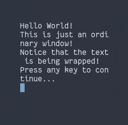
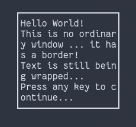
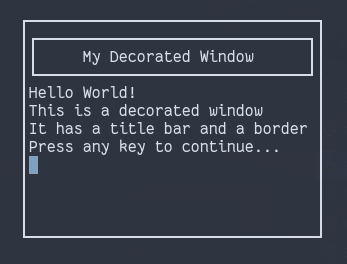
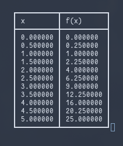
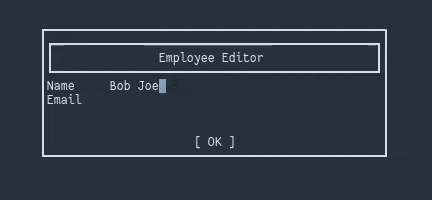

# tuicpp

tuicpp is a C++ wrapper API for ncurses which eases the developement of text
based interfaces and applications.

All API elements are enclosed inside the `tuicpp` namespace.

## Table of Contents

   * [Overview of tuicpp](#overview-of-tuicpp)
      * [Setting up](#setting-up)
      * [Import Structures](#import-structures)
         * [ScreenInfo](#screeninfo)
         * [World](#world)
      * [Window types](#window-types)
         * [PlainWindow](#plainwindow)
            * [Method Summary](#method-summary)
         * [BoxedWindow](#boxedwindow)
         * [DecoratedWindow](#decoratedwindow)

Created by [gh-md-toc](https://github.com/ekalinin/github-markdown-toc)

## Overview of tuicpp

### Setting up

The classes in `tuicpp` can be used almost immediately, however ncurses must
actually be initialized with `initscr()`. Likewise, it must be manually ended
with `endwin()` to prevent it from screwing with your terminal.

```cpp
// Example main
int main()
{
	// Initialize ncurses
	initscr();

	// tuicpp stuff goes here...

	// End ncurses
	// 	don't worry about the ncurses window
	//	handles, they are managed by tuicpp's
	//	windows
	endwin();
}
```

### Import Structures

#### ScreenInfo

The `ScreenInfo` struct is defined as follows.

```cpp
// Screen info
struct ScreenInfo {
        int height;
        int width;
        int y;
        int x;
};
```

It describes the position and size of the window. Note that `height` is before
`width` and `y` is before `x`. To avoid confusions with this altogether,
initialize these objects as follows:

```cpp
auto si = ScreenInfo {
	.height = 20,
	.width = 20,
	.y = 0,		// 0 is default
	.x = 0		// 0 is default
};
```

#### World

The `World` class does not represent an ncurses window, only the essential
members that all derived `Window` types will have.

A method to note from this class is the static `World::limits()` which returns a
`std::pair <int, int>` of the terminal's maximum height and width (note this
order).

### Window types

Now for the exciting stuff. Each section will show a snippet of code
demonstrating the construction and usage of the window and an animation of the
corresponding execution.

#### PlainWindow

As plain as a window can get.

```cpp
auto win = tuicpp::PlainWindow(
	tuicpp::ScreenInfo {
		.height = height,
		.width = width,
		.y = y,
		.x = x
	}
);

win.printf("Hello World!\n");
win.printf("This is just an ordinary window!\n");
win.printf("Notice that the text is being wrapped!\n");
win.printf("Press any key to continue...\n");
win.getc();
```

Result:



This class is important because it contains a conventional set of methods that
are inherited by all the remaining window types.

##### Method Summary

Method							| Description
---							| ---
`refresh()`						| Refreshes the window, essentially doing `wrefresh()`.
`clear()`						| Clears the window, essentially doing `wclear()`.
`erase()`						| Erase the window, essentially doing `werases()`. Unlike `clear()` there should not be as much flickering. All derived classes should this method as necessary.
`resize(int height, int width)`				| Resizes the window. Note the order of the arguments.
`move(int y, int x)`					| Moves the ***cursor*** to the yth row and xth column.
`printf(const char *fmt, ...)`				| Prints to the window, like `wprintw`.
`mvprintf(int y, int x, const char *fmt, ...)`		| Prints to the window starting at the yth row and xth column, like `mvwprintw`.
`add_char(const chtype ch)`				| Prints a characetr to the the window, like `waddch`.
`mvadd_char(int y, int x, const chtype ch)`		| Prints a characetr to the the window at the yth row and xth column, like `mvwaddch`.
`getc()`						| Get a character that the user pressed, like `wgetc()`. Will block until a key is pressed.
`set_keypad(bool bl)`					| Enables keypad for the window.
`cursor(int y, int x)`					| A more sensible alias for `move()`.
`attribute_on(int attr)`				| Turn on the attribute `attr` for the window, like `wattron()`.
`attribute_off(int attr)`				| Turn off the attribute `attr` for the window, like `wattroff()`.
`attribute_set(int attr)`				| Set the attribute for the window to `attr`, like `wattrset()`.

Some of these methods (i.e. `refresh()` and `clear()`) are overriden in derived
classes.

#### BoxedWindow

A window with a border surrounding it.

```cpp
auto win = tuicpp::BoxedWindow(
	tuicpp::ScreenInfo {
		.height = height,
		.width = width,
		.y = y,
		.x = x
	}
);

win.printf("Hello World!\n");
win.printf("This is no ordinary window ... it has a border!\n");
win.printf("Text is still being wrapped...\n");
win.printf("Press any key to continue...\n");
win.getc();
```

Result:



#### DecoratedWindow

A window with a border and a title bar.

```cpp
auto win = tuicpp::DecoratedWindow(
	"My Decorated Window",
	tuicpp::ScreenInfo {
		.height = height,
		.width = width,
		.y = y,
		.x = x
	}
);

win.printf("Hello World!\n");
win.printf("This is a decorated window\n");
win.printf("It has a title bar and a border\n");
win.printf("Press any key to continue...\n");
win.getc();
```

Result:



#### Table

Now we get into more niche window types.



#### FieldEditor

The first interactive window type.


